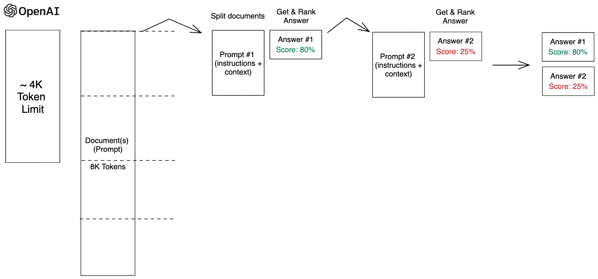

## **主要框架**
1. ### langchain 
2. ### openai
3. ### streamlit (ui展示)
#
## **本地知识库问答目录及文件简介**
1. ### **ingest.py: 此文件用于构建本地向量库，需要指定知识库路径和指定构建向量库的路径。**
    ### 主要函数：
    > RecursiveCharacterTextSplitter 
    
    - 文档转换器：用于分割超长文本，避免与openai（LLM大模型）通讯时索引的文本长度过大，影响结果准确性和提示词（propmts）过长从而导致费用上升。
    - 主要参数：`chunk_size`(分割的文本的大小), `chunk_overlap`(分割的文本之间的重合程度)

    > OpenAIEmbeddings
    - 文本嵌入模型：采取非结构化文本，并把它变成一个浮点数的列表。 

    > FAISS 
    - 矢量存储：衡量文本字符串的相关性，构建本地向量库，并在所有已知向量库中查找与其相似度较高的向量集合。
    #
2. ### **main_1.py: streamlit ui构建，运行整个程序时先运行**
    > `python3 ingest.py`
    ###
    构建向量库好之后，再构建页面。
    >`streamlit run main_1.py`
    ###
    #
3. ### **_get_answer_： 此目录用于响应javascript前端页面结合，打包了函数`get_answer`。此目录为独立目录。**
    #
4. ### **chat： 此目录下负责所有跟大模型通讯过程**
    ### 
    - ### chat/answer_processers：LLM回答结果处理
        ###
        `image_processer.py`：图片数据处理器。处理LLM语言模型回答中包含图片的路径，将图片相对路径合并为绝对路径，转变成html格式，展示在回答区域中。
        ###
        `reference_processer.py`：参考文档处理器。捕获从向量库中提取到的索引的文本的路径后，对路径进行URL编码，处理成可点击类的http链接。
        ###
        `output_parser/ty_regex.py`：处理map_rerank的打分系统
        #
        
    - ### chat/memory: 上下文功能
        ###
        `memory.py`：上下文记忆功能。在需要的时候调用。
        #
    - ### chat/openai: LLM模型定义
        ###
        `config.py`：指定openai的基本参数。
        ###
         `openai.py`：定义openai函数，为langchain调用。
         #
    - ### chat/prompts: 提示词工程
        ###
        map_rerank:
        - `example_selector.py`：回答模版向量化。设定一些问答模版，当向大模型提问之前，根据问题与回答模版的相似程度做索引和匹配，然后添加在提示词模版中，统一向大模型通讯。

        - `map_rerank_prompt.py`：提示词模版。（目前生效）接收 `{question} {context}`变量，根据获取到的问题去匹配索引文本和自定义回答模版后，向大模型提问。

        `map_reduce_prompt.py`：提示词模版。

        `refine_prompt.py`：提示词模版。

        #
    - ### chat/chain.py: 本地向量库问答
        ### 主要函数：
        > load_qa_with_sources_chain
        - 文档问答函数。包含：指定语言模型（这里默认使用openai的 `"gpt-3.5-16k-0613"`），指定提示词模版，指定`chain_type = "map_rerank"`，指定大模型做回答时处理的参数 `rank_key`， `answer_key`, `metadata_keys`。
        
        > similarity_search
        - 检索器：查询你的数据。当用户输入问题时，函数触发匹配向量库中与问题的相似程度。流程是首先获取**k**个相似文本，然后对它们进行过滤来实现的。同时可以设置 **fetch_k** 参数，以设置在过滤之前要获取多少文档。参数包含：`k`（指定索引的文本块数量），`fetch_k`（被k索引前，获取多少文档）。

    #
5. ### **loaders: 文档加载器：加载多格式文本。支持 .pdf，.md，.docx，.csv，.xlsx，.txt, .pptx，.html**
    #
6. ### **vectors: 指定要索引的向量库**
#

## **提问流程**

**构建向量库过程**

> 加载文件 ——> 读取文本 ——> 文本分割 ——> 文本向量化 ——> 构建向量库

**文本问答过程**

> 提问 ——> 问句向量化 ——> 索引向量库 ——> 在文本向量库中匹配出与问句向量最相似的`k`个文本块 ——> 在回答模版向量中匹配出与问句向量最相似的`k`个回答模版 ——> 全部添加到prompt（提示词模版）中 ——> 提交给LLM生成回答 ——> 可视化回答内容中的参考文档和图片数据。——> 在streamlit页面上展示

#
## **Chain Type: map_rerank**
Map-rerank本质上是将从向量库中索引的文档添加到提示模版中，对每一次LLM的回答进行得分评级。这些评分是按文本块收集的，获得最高得分的答案将被视为最终答案。如果`k`指定为2，则会对LLM进行两次通讯，两次回答中得分最高的将被返回。

